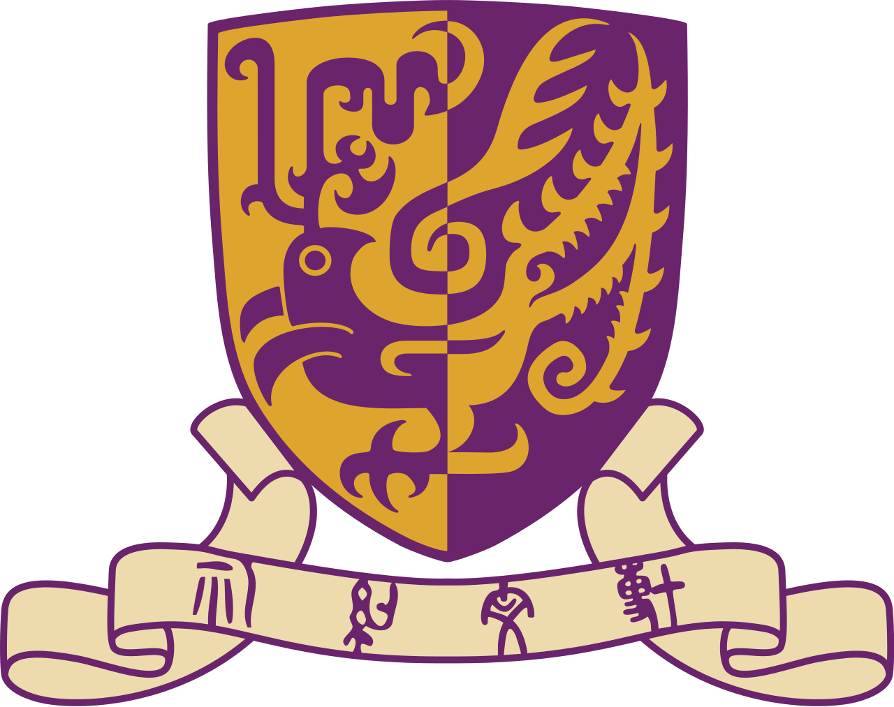
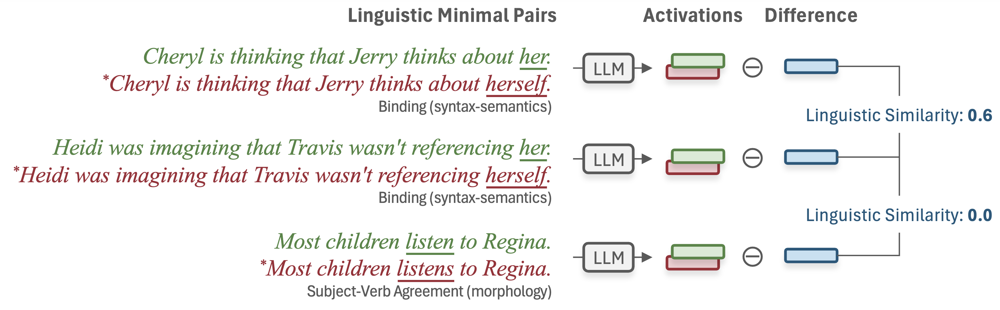

<div align="center">

## Linguistic Minimal Pairs Elicit Linguistic Similarity in <br> Large Language Models

[**Xinyu Zhou (周欣宇)**](https://www.linkedin.com/in/xinyu-zhou2000/)*
 &nbsp; &nbsp;
[**Delong Chen (陈德龙)**](https://chendelong.world/)*
 &nbsp; &nbsp;

[**Samuel Cahyawijaya**](https://samuelcahyawijaya.github.io/)
 &nbsp; &nbsp;
[**Xufeng Duan (段旭峰)**](https://xufengduan.github.io/)
 &nbsp; &nbsp;
[**Zhenguang G. Cai (蔡振光)**](https://sites.google.com/site/zhenguangcai/)


&nbsp; &nbsp; &nbsp; &nbsp; &nbsp; &nbsp;
 

\* *Equal Contribution*

<!-- [ArXiv]() |
Data (Coming Soon) -->

</div>


<!-- ## News
- **2024.09.20**. Our paper is available on arXiv [(arXiv link)](). -->

## Introduction

This project introduces a novel analysis that leverages linguistic minimal pairs to probe the internal linguistic representations of Large Language Models (LLMs). By measuring the similarity between LLM activation differences across minimal pairs, we quantify the linguistic similarity and gain insight into the linguistic knowledge captured by LLMs.

<p align="center">

</p>

We extract LLM activations for sentences in linguistic minimal pairs and compute their differences. Since the sentences differ solely in a specific linguistic phenomenon, the resulting difference only contains information about that phenomenon. We then measure the similarity between these activation differences, which we refer to as linguistic similarity.


Our large-scale experiments, spanning 100+ LLMs and 150k minimal pairs in three languages, reveal properties of linguistic similarity from four key aspects:

1. **Consistency across LLMs**: Linguistic similarity is significantly influenced by training data exposure, leading to higher cross-LLM agreement in higher-resource languages.

2. **Relation to theoretical categorizations**: Linguistic similarity strongly aligns with fine-grained theoretical linguistic categories but weakly with broader ones.

3. **Dependency to semantic context**: Linguistic similarity shows a weak correlation with semantic similarity, showing its context-dependent nature.

4. **Cross-lingual alignment**: LLMs exhibit limited cross-lingual alignment in their understanding of relevant linguistic phenomena.

## Calculating Linguistic Similarity

The following code snippet demonstrates how to calculate linguistic similarity using linguistic minimal pairs. It requires [`transformers`](https://huggingface.co/docs/transformers/installation) and [`torch`](https://pytorch.org/get-started/locally/) libraries installed. 

```python
import torch

@torch.no_grad()
def get_activation_difference(model, minimal_pair, layer_index):

    # tokenize the input sentences
    intputs = tokenizer(
        [minimal_pair['correct'], minimal_pair['incorrect']], 
        return_tensors='pt').to(device)
    
    # get all hidden states in the model
    hidden_states = model(
        **intputs, output_hidden_states=True).hidden_states
    
    # get the activation of the last token (-2 is the last token, -1 is eos)
    activations = hidden_states[layer_index][:, -2, :]
    
    # calculate difference by subtracting the activations
    return activations[0] - activations[1]
```

For example, we can calculate the linguistic similarity between two minimal pairs using the [`GPT-2`](https://huggingface.co/openai-community/gpt2) model:

```python
from transformers import AutoTokenizer, AutoModelForCausalLM
device = 'cuda' if torch.cuda.is_available() else 'cpu'

model_name = 'openai-community/gpt2'
tokenizer = AutoTokenizer.from_pretrained(model_name)
model = AutoModelForCausalLM.from_pretrained(model_name).to(device).eval()

minimal_pair_a = {
    'correct':  'The cat is cute.',
    'incorrect': 'The cat are cute.'
}

minimal_pair_b = {
    'correct': 'She is a computational linguist.',
    'incorrect': 'She are a computational linguist.'
}

diff_a = get_activation_difference(model, minimal_pair_a, layer_index=2)
diff_b = get_activation_difference(model, minimal_pair_b, layer_index=2)

# calculate the cosine similarity between the two differences
linguistic_similarity = torch.nn.functional.cosine_similarity(
    diff_a, diff_b, dim=0).item()

print(f'Linguistic similarity: {linguistic_similarity:.4f}')
```

```
>>> Linguistic similarity: 0.2474
```

## Pre-computed Activation Differences and Linguistic Similarities of 104 LLMs

Coming soon.